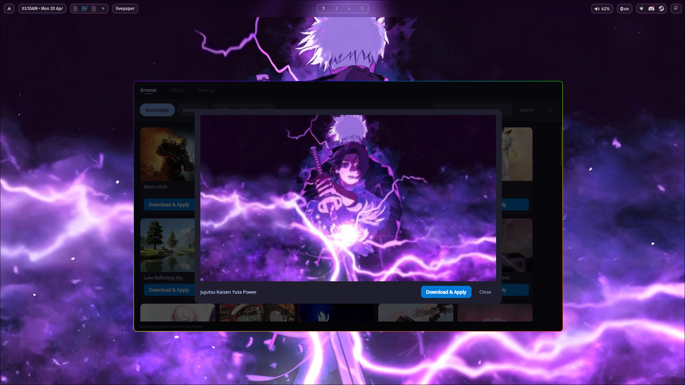
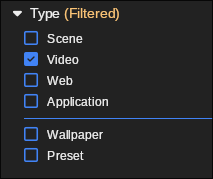

# livepaper

A live wallpaper manager for Wayland. Browse and download animated wallpapers from online sources, or play wallpapers directly from your local Wallpaper Engine library — all applied to your desktop using [mpvpaper](https://github.com/GhostNaN/mpvpaper).



## Requirements

- Wayland compositor (Hyprland, Sway, GNOME on Wayland, etc.)
- [mpvpaper](https://github.com/GhostNaN/mpvpaper)
- .NET 10 SDK (for building from source)

## Installation

### AUR

```bash
yay -S livepaper-git
```

### From source

```bash
git clone https://github.com/sunwoo101/livepaper.git
cd livepaper
bash scripts/install.sh
```

Installs the binary to `~/.local/bin/livepaper` and registers the app in your launcher.

## Usage

```bash
livepaper                     # open the app
livepaper --restore           # re-apply the last wallpaper without opening the app
livepaper --random            # apply a random wallpaper from your library
livepaper --kill              # stop the wallpaper
livepaper --action=<action>   # control the running session (see Compositor keybinds)
```

### Autostart

To restore your wallpaper on login, add to your compositor config:

**Hyprland** (`hyprland.conf`):
```
exec-once = livepaper --restore
```

**Sway** (`config`):
```
exec livepaper --restore
```

### Compositor keybinds

`--action=<action>` controls a running session without opening the UI. Available actions:

- `stop` — stop playback
- `play` — relaunch the last session
- `toggle-play` — stop if playing, otherwise relaunch the last session
- `toggle-pause` — pause/resume playback (and freeze/resume the playlist timer)
- `toggle-mute` — toggle audio mute
- `next-wallpaper` — skip forward in the playlist
- `previous-wallpaper` — go back one wallpaper

The Settings tab provides ready-to-copy snippets for each.

**Hyprland** example:
```
bind = SUPER, M, exec, livepaper --action=toggle-mute
bind = SUPER, N, exec, livepaper --action=next-wallpaper
bind = SUPER, P, exec, livepaper --action=toggle-play
```

## Sources

- **motionbgs.com** — large collection of animated wallpapers
- **moewalls.com** — anime-style animated wallpapers
- **desktophut.com** — animated wallpapers
- **Wallpaper Engine** — your local Wallpaper Engine library (Steam workshop, **Video type only**)

  Filter by Video type in Wallpaper Engine to find compatible wallpapers:

  

## Library

Downloaded wallpapers are saved to `~/.local/share/livepaper/library/`. Use the Library tab to apply, delete, or build playlists from them. **Multi-select** with Shift-click / Ctrl-click / Ctrl+A — a toolbar appears at the bottom with bulk actions (Add to Playlist, Remove from Playlist, Delete).

**Play All** plays your entire library; rotation behaviour follows the global Settings → Playlist panel (timer interval or advance-on-video-end). The **Shuffle** toggle randomizes the order.

## Playlists

Build a custom playlist by clicking the **+** button on any library card. The playlist strip at the bottom of the Library tab supports drag-and-drop reordering. Click any thumbnail to play from that wallpaper, or use the **−** button to remove it from the playlist.

The ⚙ settings popup controls Sequential/Shuffle ordering. Rotation cadence (timer interval or advance-on-video-end) defaults to your global preference; tick **Override global rotation settings** to give a specific playlist its own interval or behaviour.

Save and load named playlists via the toolbar above the strip — playlists are stored in `~/.local/share/livepaper/playlists/` as JSON.

## Settings

The Settings tab covers:

- **Playback** — loop, mute, disable cache, and a live volume slider
- **Playlist** — global rotation defaults: switch when video ends, or switch every Hours/Minutes/Seconds. Used by Play All and any playlist that doesn't override the globals.
- **Auto-Mute** — automatically mutes the wallpaper when other audio is playing (e.g. videos, music, calls), with configurable threshold and mute/unmute delays
- **Memory** — mpv demuxer cache size limits
- **Rendering** — hardware decoding mode (auto / nvdec / vaapi / no)
- **Wallpaper Engine** — workshop folder + copy-files toggle

## Building

```bash
dotnet run --project src/livepaper     # run
bash scripts/build-appimage.sh         # build AppImage
bash scripts/install.sh                # install system-wide
```
